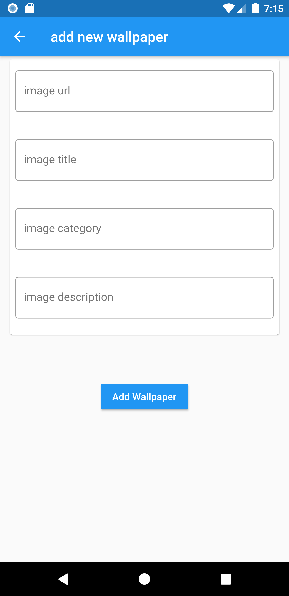

# sqllite_flutter_crud_wallpapers_app
simple flutter app to demonstrate the integration and CRUD operation with sqllite and flutter . By using the singleton design pattern.

## check out my video documentation of this app here

## screenshots  

## Getting Started with flutter

A few resources to get you started if this is your first Flutter project:

- [Lab: Write your first Flutter app](https://flutter.dev/docs/get-started/codelab)
- [Cookbook: Useful Flutter samples](https://flutter.dev/docs/cookbook)

For help getting started with Flutter, view our
[online documentation](https://flutter.dev/docs), which offers tutorials,
samples, guidance on mobile development, and a full API reference.
